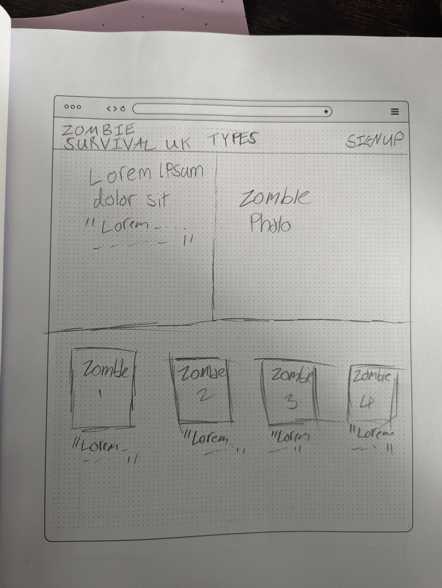
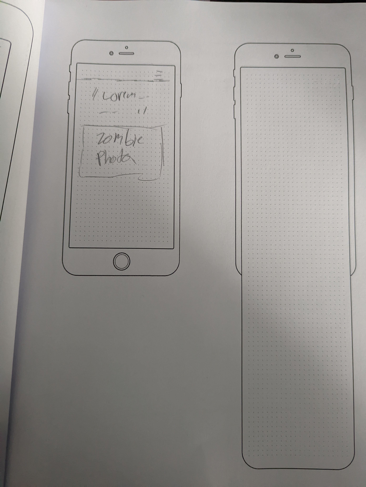
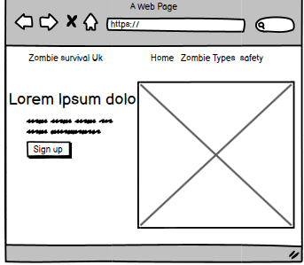
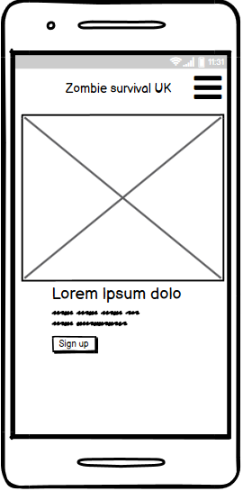
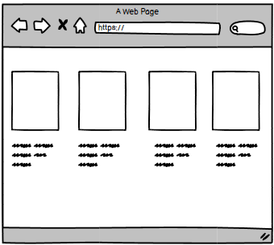
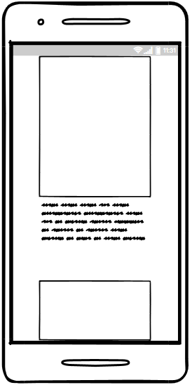
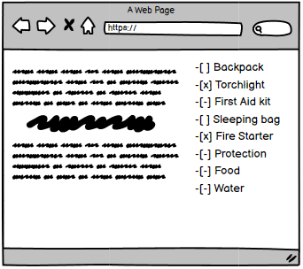
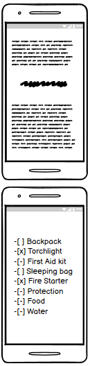
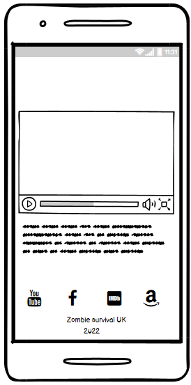

# Zombie survival uk
Code-Institute Diploma in Web Development

# Table of Contents

1. [Introduction](#introduction)
2. [User Experience](#user-experience)
3. [Design](#design)
      - [Skeleton](#skeleton)

# Introduction

This website has been designed to advise service users on how to identify zombie types, improve their odds of survival during a zombie outbreak and help connect with fellow zombie survival enthusiasts.

The information based on this website is fictional being as zombies are currently fictional. All zombie information has been obtained from various films, books, tv shows and other media thought the years. All **Survival** information is based on real proven survival skills I have learnt throughout my training with the scouts  

This is my first milestone project with the Code Institute on the Full Stack Web Devlopment Program the main aim is to produce a responsive website with a minimum of three pages using  **CSS** and **HTML5**

[Back to top](#zombie-survival-uk)

# User Experience
### Project Goals
-To produce an informative website
-To allow easily accessible information that's clear to navigate to
-To enable users to connect to a larger community 
-To maintain usability for all service users

# Design
## skeleton

A physical sketchbook was used to create the first draft of a wireframe as it provided a very fast easily modifiable platform for a rough design plan.

Once I was happy with the basic design I produced a digital wireframe using Balsamiq. 

I was unable to make a wireframe for a sign-up page as unhappy with the options available to me on Balsamiq. 

Sketchbook Design:

Balsamiq Design:

### Photos

[Back to top](#zombie-survival-uk)