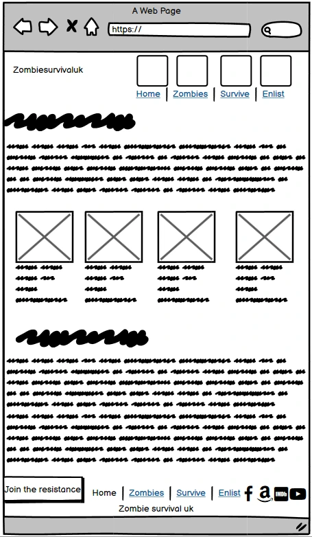

# Zombie survival uk

Code-Institute Diploma in Web Development

[--Come see the Live Site--](https://dominic-wells.github.io/Milestone-Project-1/index.html)

# Table of Contents

1. [Introduction](#introduction)
2. [User Experience](#user-experience)
   - [User stories](#user-stories)
3. [Design](#design)
   - [Colour Scheme](#Colour-Scheme)
   - [Typography](#Typography)
   - [Skeleton](#skeleton)
   - [Site theme](#Site-theme)
   - [Features](##Features)
4. [Technologies Used](#Technologies-Used)

# Introduction

This website has been designed to advise service users on how to identify zombies, improve their odds of survival during a zombie outbreak and help connect with fellow zombie survival enthusiasts.

The information based on this website is fictional being as zombies are currently fictional. All zombie information has been obtained from various films, books, tv shows and other media thought the years. All **Survival** information is based on real proven survival skills I have learnt throughout my training with the scouts

This is my first milestone project with the Code Institute on the Full Stack Web Devlopment Program the main aim is to produce a responsive website with a minimum of three pages using **CSS** and **HTML5**

[Back to top](#zombie-survival-uk)

# User Experience

### Project Goals

- To produce an informative website
- To allow easily accessible information that's clear to navigate to
- To enable users to connect to a larger community
- To maintain usability for all service users

## User stories

| As a client I want                                           |
| ------------------------------------------------------------ |
| Educate a wide range of visitors                             |
| Visitors to be engaged as soon as they enter the site        |
| An intuitive non-complex interface that's easy to navigate   |
| Visitors to be able to reach out and connect if they want to |

| As a first time visitor                                                                                                 |                                                            As a returning visitor                                                            |                                                                                       As a frequent visitor |
| ----------------------------------------------------------------------------------------------------------------------- | :------------------------------------------------------------------------------------------------------------------------------------------: | ----------------------------------------------------------------------------------------------------------: |
| As a first-time visitor, I want to understand the main use of the site within the first 10 seconds                      | As a returning visitor, I want to conveniently access social media links so that I can follow on my chosen platforms after visiting the site | As a frequent visitor, I want to be able to contact the site owner to ask questions and build a connection. |
| As a first-time visitor I want an intuitive non-complex interface that's easy to navigate to the conntent I want to see |                As a returning visitor, I want to have fast access to the information and not get distracted by advertisements                |                                                                                                         $12 |
| As a first-time visitor I want to be able to view the site at my convenience at any location on my available device     |           As a returning visitor, I want to be able to find the information I want conveniently, not having to read the whole site           |                                                                                                          $1 |
| As a first-time visitor I want to learn about zombies and survival in the UK                                            |                              As a returning visitor, I want To be able to receive updates about zombie survival                              |                                                                                                       $1600 |
| As a first-time visitor I want To be able to access and understand the site regardless of my disability                 |                                                                   centered                                                                   |                                                                                                         $12 |
| zebra stripes                                                                                                           |                                                                   are neat                                                                   |                                                                                                          $1 |

[Back to top](#zombie-survival-uk)

---

# Design

## Colour Scheme

I wanted to use army/survival coloring based on traditional colours.

Army color palette inspiration 

  
The core colours I used were Green(#4a572c) Beige(#fcf1c8) Navy(#1e3030), black(#FFFFFF) and white(#000000).  

main colours ratio

## Typography

I didn't want the fonts to be too distracting, I limited my fonts to the following;

- Roboto Condensed
- Roboto Flex
- Anton.

with sans-serif as the default backup.

## Site theme

I wanted the overall site to not distract the visitors from the information provided. A minimalist aesthetic has been adopted, using simple fonts and complementing colouring. I chose to incorporate high-quality images throughout the entire website attempting to avoid low-quality images and illustrations. I also avoided overusing visual effects and some users find them too distacting.

## Skeleton

A physical sketchbook was used to create the first draft of a wireframe as it provided a very fast easily modifiable platform for a rough design plan.

Once I was happy with the basic design I produced a digital wireframe using Balsamiq.

As I started to develop my website I was unhappy with my original designs; for example, I wanted my home page to be more captivating and once made I felt my first design was too distracting. I amended my frameworks after completing my homepage as I felt the new design themes better matched my original goals of the website.

I was unable to make a wireframe for a sign-up page as unhappy with the options available to me on Balsamiq.

Overall I enjoyed the design development stage of the project and I felt letting my design organically grow and not restricting myself to the first design produced a better outcome for the project.

Sketchbook Design:

A rough wireframe design in a sketchbook desktop style

A rough wireframe design in a sketchbook mobile style

 

Balsamiq original Design:

A rough wireframe design in Balsamiq desktop style

A rough wireframe design in Balsamiq mobile style

A rough wireframe design in Balsamiq desktop style

A rough wireframe design in Balsamiq mobile style

A rough wireframe design in Balsamiq desktop style

A rough wireframe design in Balsamiq mobile style

A rough wireframe design in Balsamiq desktop style

A rough wireframe design in Balsamiq mobile style

## Balsamiq finale designs

### Home page(index.html)

A wireframe design in Balsamiq Mobile

A wireframe design in Balsamiq Tablet

A wireframe design in Balsamiq Desktop

 

### Zombie page(Zombies.html)

A wireframe design in Balsamiq Mobile

A wireframe design in Balsamiq Tablet

A wireframe design in Balsamiq Desktop

 

### Survive page(Survival.html)

A wireframe design in Balsamiq Mobile

A wireframe design in Balsamiq Tablet

A wireframe design in Balsamiq Desktop

 

### Enlist page(Enlist.html)

A wireframe design in Balsamiq Mobile

A wireframe design in Balsamiq Tablet

A wireframe design in Balsamiq Desktop

 

[Back to top](#zombie-survival-uk)

## Features

-Fully responsive across a wide range of devices and systems 
-A Favicon was added to the webpage to allow ease of identifying zombie survival UK when not currently viewing on the visitor's internet browser 
-A modal form with a thank you page

### Site-wide

**1. Navbar**

- Logo maintains visibility on all device sizes
- Logo acts as the Home button to avoid duplication and clutter
- Hoverable links provide responsive visual feedback
- Active links clearly indicate current location on site

**2. Footer**

- Link to top of the page provided to allow easy navigation across all devices
- Email me link provided to allow contact with the site
- Social media and relevant icons with blank targets links are used to prevent disruption in the browsing experience
- Copyright
- Footer is always positioned at the bottom of the page for consistency and visual appeal across all devices
- Access to a form where the visitor to provide contact information to "Join the resistance" (currently leads to an Emitpy page with a thank you statement to confirm the form works)

### Individual pages

**3. Home page**

- Full hero image and a Call to action button with an engaging question to make an immediate connection with the visitors
- A Non-distracting text with a comic description on what the user can Hope to find on the site

**4. Zombies page**

- Boostrap cards use to provide clear distinct groups
- Progress bars were added within the cards to provide a visual guide to the visitors
- External site links were added to the cards in the form of buttons to provide visitors access to files the distinct groups were based on
- A modified ordered list was added to provide users with easy-to-follow rules about zombie survival

**5. Survive page**

- Survival topics are divided into individual sections
- Links added to an external site when relevant
- Use of bold text to alert visitors to kill information
- Details tag used to provide a simple fire-making guide to visitors
  without overwhelming visitors visual experience
- An automated yet controllable carousel was used to provide visitors with a range of visual images
- A video was provided to visitors to demonstrate the need for tools in a survival environment that was responsive to the user inputs (pause and play)

**6. Enlist page**

- A striped table in the theme of the main website colour was used to provide the visitors with information
- An embed youtube was provided to the visitors as a form of comic information

[Back to top](#zombie-survival-uk)

# Technologies Used

### Languages

- HTML
- CSS
- Javascript

  - [Bootstrap 5](https://getbootstrap.com/docs/5.0/getting-started/introduction/) - Modal form- Video pause/play

  ### Project management

- [GitHub](https://github.com/) - Version control and deployment of live site
- [Balsamiq](https://balsamiq.com/wireframes/) - Wireframe tool
- [Visual Studio Code](https://code.visualstudio.com/) - IDE used to code the site

### Theme and styles

- [Bootstrap 5](https://getbootstrap.com/) - Responsive grid and styling framework
- [favicon.io](https://favicon.io/) - Freetool used to generate the site favicon
- [Font Awesome](https://fontawesome.com/) - Used for icons on navbar and footer
- [Google Fonts](https://fonts.google.com/) - Used to load Fonts onto site
- [photopea](https://www.photopea.com/) - Used to make my Logo

### Image manipulation

- [RedKetchip](https://redketchup.io/image-resizer) - A program used for modifying aspect ratios and file types

### Online resources

- [Youtube](https://www.youtube.com//) -Used for inspiration
- [Stack Overflow](https://stackoverflow.com/) - Used to find answers
- [Reddit](https://reddit.com) - Used to engage with the community
- [Amiresponsive](https://ui.dev/amiresponsive#) - Used to make screen shots of the various device breakpoints for responsive design
- [W3 Schools](https://www.w3schools.com/) -Used to provide issue assistance
- [Bootstrap 5](https://getbootstrap.com/docs/5.2/getting-started/introduction/) - Documentation used to support issues problem solving and provide guidance on framework features

[Back to top](#zombie-survival-uk)

## Testing

Please find the testing informaion on the following link

[Link to Testingmd](https://github.com/Dominic-wells/Milestone-Project-1/blob/main/Testing.md)
