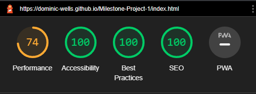
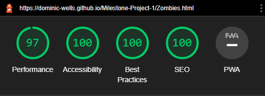
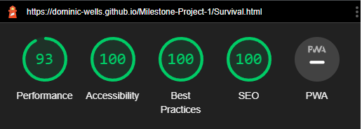
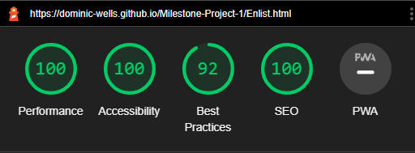

# Testing

## Contents

- [Automated Testing](#automated-testing)
- [Testing Summary](#testing-summary)
  - [Lighthouse Images](#lighthouse-in-devtools) -[Home page](#home-page) -[Zombie page](#zombie-page) -[Survival page](#survival-page) -[Enlist page](#enlist-page)
- [HTML Validation](#html-validation)
- [CSS Validation](#css-validation)
- [Manual Testing](#manual-testing)
- [User Stories Testing](#user-stories-testing)
- [Client stories](#client-stories)
- [First Time Visitor](#first-time-visitor)
- [Returning Visitor](#returning-visitor)
- [frequent Time Visitor](#frequent-visitor-goals)
- [Bugs](#bugs)

---

## Testing

### Automated testing

[Google chromes Lighthouse](https://developer.chrome.com/docs/lighthouse/) built-in developer tool was used for automated testing of the pages in both desktop and mobile views.

### Testing Summary

- Performance
  - The worst metric was due to issues around The hero image size on the index.html page when viewed in mobile.
  - A lower score was given on the survival.html due to the larage amount of images
- Accessibility
  - The lowest score given was 100%
- Best Practices
  - The main issue with the best practice audit was due to my embedded youtube video on the Enlist.html page
- SEO
  - The lowest score given was 100%

[Back to top](#Contents)

---

## Lighthouse images

### Home page

Lighthouse Homepage Dekstop

 

### Zombie page

Lighthouse Zombie page Dekstop

 

### Survival page

Lighthouse Survival page Dekstop

 

### Enlist page

Lighthouse Enlist page Dekstop

 

[Back to top](#Contents)

---

### HTML Validation

[W3C Markup Validation Service](https://validator.w3.org/) Used on all pages of website, all passed

Home page

Zombies page

Survive page

Enlist page

[Back to top](#Contents)

### CSS Validation

[jigsaw.w3 css-validator](https://jigsaw.w3.org/css-validator/) Used on all pages of website, all passed

Home page

Zombies page

Survive page

Enlist page

[Back to top](#Contents)

---

## Manual Testing

The website was viewed with browsers: Google Chrome, Microsoft Edge and Firefox and viewed on Pixle 6/find x 2 Neo phone. All four pages were viewed and the following was checked:
-The Nav bar worked with no issues on any links 
-The Nav bar resizes correctly 
-The modal form opens and closes 
-The modal form resized correctly 
-The "required" code works on the modal form requiring the visitor to enter the correct information 
-The Footer worked with no issues on any links 
-The Footer resizes correctly 
-Social medial links worked 
-Email me link works 
-All "Hover" effcts worked on desktops.

On the Home page I cheaked in particular: 
-The text section and image section both resized correctly and displayed in the order I wanted (text on top image on bottom)

On the Zombie page I checked in particular: 
-The cards resized correctly on various screen sizes

On the survive page I checked in particular: 
-The text section and image section both resized correctly and displayed in the order I wanted (image on top and text on bottom) 
-The amazon link worked on the water section  
-The "details" worked and displayed the text correctly 
-The list in the weapon section would transform from Two rows to one column on smaller screens 
-The Carousel displayed correctly when resized and was able to change the image by the directional arrows within the image on hover or click on phones/tablets. 
-The tools video displayed correctly when resized and was able to be played on click of video and paused on click on video 

On the Enlist page I checked in particular: 
-The striped table displayed correctly when resized to smaller screens 
-The youtube video displayed correctly when reiszed to a smaller screen 
-The youtube video repsoned to vistor inputs such as play, pause and fullscreen. 

I had my friends test the site on their computers and phones they reported no bugs just isuss with grammer and spelling

[Back to top](#Contents)

---

## User Stories Testing

## Client stories

1. As a client I want, to educate a wide range of visitors. 
   I met this in the first time visitor section

2. As a client I want, visitors to be engaged as soon as they enter the site. 
   I met this by making a call to action buttion with a question one of the first items they see when visting the site

3. As a client I want, An intuitive non-complex interface that's easy to navigate. 
   I met this in the first time visitor section.

4. As a client I want, Visitors to be able to reach out and connect if they want to. 
   I met this in the frequent visitor section.

[Back to top](#Contents)

---

## First Time Visitor

1. As a first-time visitor, I want to understand the main use of the site within the first 10 seconds. 
   I met this by naming the site and adding a logo with an identifying clear name" zombie Survival UK" furthermore I added an introduction to the first page the user would visit.

2. As a first-time visitor I want an intuitive non-complex interface that's easy to navigate to the conntent I want to see. 
   I met this by building a site with standard format and a well known website layout (Navbar, Main, Footer) I also avoided distracting effects and colours.

3. As a first-time visitor I want to be able to view the site at my convenience at any location on my available device . 
   I met this by making the website viewable across a wide range of devices, web browser and operating systems.

   

viwed on different screen sizes

   

viwed on Chrome web browser

   

viwed on Firefox web browser

4. As a first-time visitor I want to learn about zombies and survival in the UK. 
   I meet this by displaying a wide range of information on survival and general zombie knowledge.

   

Zombie information

   

Zombie information

   

Survival information

   

Survival information

5. As a first-time visitor I want To be able to access and understand the site regardless of my disability.> 
   I met this by making the site to a high standard using good practices and accessibility guidelines, testing for accessibility during development

[Back to top](#Contents)

---

## Returning Visitor

1. As a returning visitor, I want to conveniently access social media links so that I can follow on my chosen platforms after visiting the site. 
   I met this by building social media links with icons that open a new tab when clicked conveniently located in the footer of every page (not Thankyou.html)

2. As a returning visitor, I want to have fast access to the information and not get distracted by advertisements. 
   I met this by making use of tools such as lighthouse to optimize the website to improve loading times, I will not load advertisements

   
   

Audits Passed 1

   

Audits Passed 2

3. As a returning visitor, I want to be able to find the information I want conveniently, not having to read the whole site. 
   I met this by making multiple pages with a different subjects. I also included header titles of different topics within the different pages.

   
   
   
   

4. As a returning visitor, I want To be able to receive updates about zombie survival. 
   I met this by adding a form for the user to be able to interact with the site by adding their contact informatio,the information is not processed as it is beyond scope of this project, once the visitor as entered information they will be directed to a "thank you page"). 

Form page text

[Back to top](#Contents)

---

## Frequent Visitor Goals

1. As a frequent visitor, I want to be able to contact the site owner to ask questions and build a connection. 
   I met this by adding an email link in the footer that opens open for the visitor to be able to email me directly

   
   

[Back to top](#Contents)

---

### Bugs

When developing the website I found issues and bugs.
| Bug | Solution |
| ------------- |:-------------:|
| I found issues where the logo image and icon links would extend under the navbar when viewed on smaller screens | After researching on StackOverflow and documentation on the bootstrap website I found I made the nav bar too small and needed to increase the height due to my logo being larger than standard text. |
| I found an issue where the logo and nav links were too close even after increasing the navbar size after fixing the previous issue, I however didn't want to increase the height of the current navbar as I had my desired hight already | I resolved this by making a media query where I would increase the navbar height when the website was viewed on smaller screens allowing me to add some padding and centre links and logo |
| I found an issue with my hero image on my index.html page would not fill the width of the screen, even when I set the padding to o on both sides. It would only work on desktops (larger screens) | I then realised I was using the wrong container and did not need to contain it all within another div, as it added padding |
| When positioning the "call to action hero box" I wanted the box to not it in the way of the zombie's face during desktop viewing | I increased the padding but found when viewing on small screens such as the Galaxy Fold that the box would be far too low and I didn't like the look, I made a media query to lower some of the padding on smaller screens |
| I had an issue with a section under my hero section that on viewing with smaller screens it would prioritize the photo first above the text. | After researching I found that I could reorder using the order classes(.order-) making the image an order-last and the text order-first |
| I had an issue when embedding a youtube video it was not responsive | After researching on google I found some useful information at(https://jasonmkelly.com/jason-m-kelly/2020/3/17/making-your-youtube-videos-responsive). Code and CSS from the above site were used to make the video responsive; I however found the video too large. I resolved this by placing the responsive video into my own made container allowing me to place and size at my own discretion whilst still keeping the resized video properties |
| I found an issue with images not loading in GitHub pages | I had used the wrong file path, the one I used would work on my local live page but with Github pages |
| Github would not load videos from my files | I had to use the full address they stored it at( https://github.com/Dominic-wells/Milestone-Project-1/raw/main/assets/images/Axe.mp4 ) |
| When making the footer I wanted to add a link for the users to be able to email me directly but the link wouldn't open correctly | I needed to add <b>mailto</b> in my herf tag(guidance how to do this at (https://www.w3schools.com/tags/tag_address.asp)) |
| The Site would not load as fast as I wanted it to| I Improved performance by changing file types and sizes from jpgs to webp|
| The Progress bars on the card sections were not alining right correctly| I placed them in the wrong div|

## [Back to top](#Contents)

---
