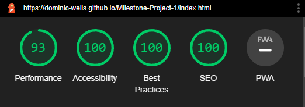
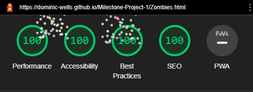
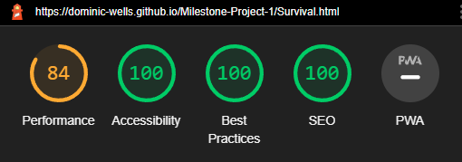
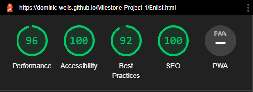
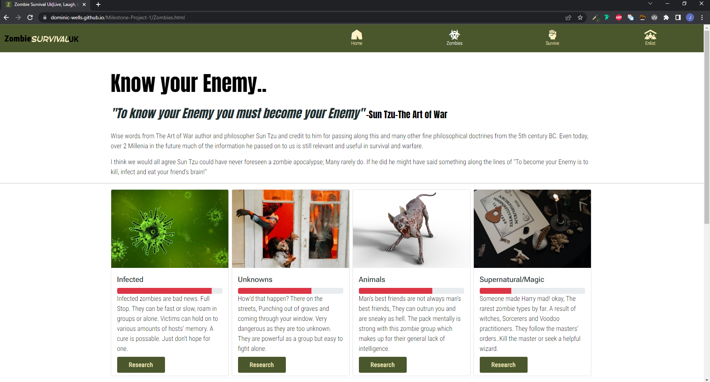
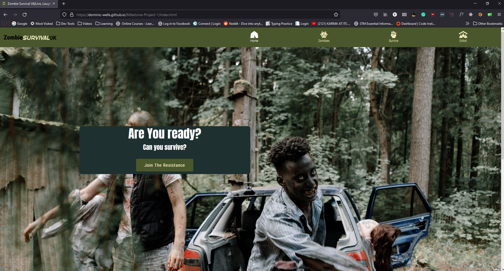
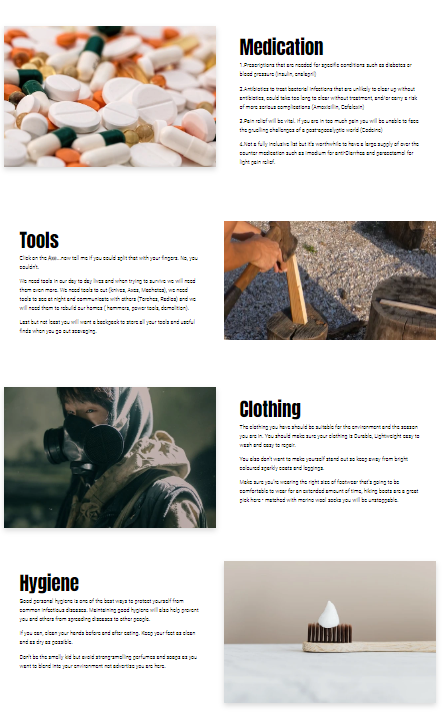
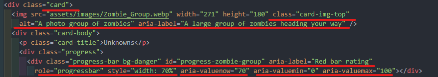

## Testing

### Automated testing

[Google chromes Lighthouse](https://developer.chrome.com/docs/lighthouse/) built-in developer tool was used for automated testing of the pages in both desktop and mobile views.

### Testing Summary:

- Performance
  - The worst metric was due to issues around The hero image size on the index.html page when viewed in mobile.
  - A lower score was given on the survival.html due to the larage amount of images
- Accessibility
  - The lowest score given was 100%
- Best Practices
  - The main issue with the best practice audit was due to my embedded youtube video on the Enlist.html page
- SEO
  - The lowest score given was 100%

## Lighthouse images

### Home page

Lighthouse Homepage Dekstop

 

### Zombie page

Lighthouse Zombie page Dekstop

 

### Survival page

Lighthouse Survival page Dekstop

 

### Enlist page

Lighthouse Enlist page Dekstop

 

### HTML Validation

[W3C Markup Validation Service](https://validator.w3.org/) Used on all pages of website, all passed

Home page

Zombies page

Survive page

Enlist page

### CSS Validation

[jigsaw.w3 css-validator](https://jigsaw.w3.org/css-validator/) Used on all pages of website, all passed

Home page

Zombies page

Survive page

Enlist page

## User Stories Testing

| As a client I want                                           |
| ------------------------------------------------------------ |
| Educate a wide range of visitors                             |
| Visitors to be engaged as soon as they enter the site        |
| An intuitive non-complex interface that's easy to navigate   |
| Visitors to be able to reach out and connect if they want to |

## First Time Visitor

1. As a first-time visitor, I want to understand the main use of the site within the first 10 seconds. 
   I met this by naming the site and adding a logo with an identifying clear name" zombie Survival UK" furthermore I added an introduction to the first page the user would visit.

2. As a first-time visitor I want an intuitive non-complex interface that's easy to navigate to the conntent I want to see. 
   I met this by building a site with standard format and a well known website layout (Navbar, Main, Footer) I also avoided distracting effects and colours.

3. As a first-time visitor I want to be able to view the site at my convenience at any location on my available device . 
   I met this by making the website viewable across a wide range of devices, web browser and operating systems.

   

viwed on different screen sizes

   

viwed on Chrome web browser

   

viwed on Firefox web browser

4. As a first-time visitor I want to learn about zombies and survival in the UK. 
   I meet this by displaying a wide range of information on survival and general zombie knowledge.

   

Zombie information

   

Zombie information

   

Survival information

   

Survival information

5. As a first-time visitor I want To be able to access and understand the site regardless of my disability> 
   I met this by making the site to a high standard using good practices and accessibility guidelines, testing for accessibility during development

## Returning Visitor

1. As a returning visitor, I want to conveniently access social media links so that I can follow on my chosen platforms after visiting the site. 
   I met this by building social media links with icons that open a new tab when clicked conveniently located in the footer of every page (not Thankyou.html)

2. As a returning visitor, I want to have fast access to the information and not get distracted by advertisements. 
   I met this by making use of tools such as lighthouse to optimize the website to improve loading times, I will not load advertisements

   
   

Audits Passed 1

   

Audits Passed 2

3. As a returning visitor, I want to be able to find the information I want conveniently, not having to read the whole site. 
   I met this by making multiple pages with a different subjects. I also included header titles of different topics within the different pages.

   
   
   
   

4. As a returning visitor, I want To be able to receive updates about zombie survival. 
   I met this by adding a form for the user to be able to interact with the site by adding their contact informatio,the information is not processed as it is beyond scope of this project, once the visitor as entered information they will be directed to a "thank you page"). 

Form page text

